# 6D Pose Review

### What do those papers said about it?

* templated-based 
  * useful in detecting texture-less objects.
  * cannot handle occlusions between objects very well
  * because the template will have low similarity score if the object is occluded.
* feature-based
  * require sufficient textures on the objects in order to compute the features (if traditional features are used)

### 从不同的角度取审视的话，会存在多种分类

* 从直接间接的角度
  * 直接法：直接进行估计位姿的方法
  * 间接法：通过2D-3D关系，间接通过PnP类算法进行位姿估计的方法
    * 少许关键点的间接法
      * 关键点的表示形式：
        * 直接像素坐标作为关键点的坐标
        * 有些是通过预测heatmaps得到关键点的坐标（heatmap representation）
    * 密集的2D-3D对应关系的间接法
* 从回归还是分类的角度来看
  * 有些方法是直接回归得到位姿的数值
  * 而有些方法则是将位姿估计当作一个分类问题，特别是旋转量，当成一个分类量来估计。
* 有些论文的related work中会提到又CNN-Based的方法，划分根据是否使用了CNN
  * 一些早期的方法是不使用CNN的，比如模板匹配，纯点云匹配的方法
* 从使用的信息来看
  * RGB
  * RGB-D
  * 点云，仅D
* 从物体的分类来看
  * instance-level 对象级别
    * instance-level的位姿估计通常需要知道检测物体的CAD模型
    * 这些CAD模型可能在训练是用到，可能在计算一些指标的时候用到。
    * 可能在对新的物体，没有见过的物体进行检测的时候就不是那么好使
  * category-level 类级别

# Details of some papers

## 间接法

### **BB8 from CVPR2017**

* 仅用RGB
* 同时也是**关键点**的预测，使用CNN估计物体的三维边界框的角点，随后用PnP
* 针对对称的物体的位姿估计又进行了优化，主要针对的是T-LESS数据集
* 会进行粗略的分割
* first find a 2D segmentation mask around the object and present a cropped image to a second network that predicts the eight **2D corners** in the image  

---

### **[YOLO6D（2018）](https://github.com/microsoft/singleshotpose)**

* 论文名字：**Real-time seamless single shot 6d object pose prediction**
* RGB only
* 间接法
* 改版yolov2网络预测物体的三维边界框的8个角点在图片上的投影，外加一个中心点，随后用PnP
* **每个cell内设置5个anchors，也就是每个cell中最多预测5个物体**
* **anchors的大小也是提前使用k-means算法得到，和yolo-v2相似。**

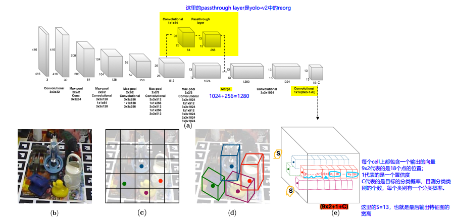

---

### **6-DoF Object Pose from Semantic Keypoints**  

* 间接法
* **heatmap**预测关键点
* 没有使用PnP
  * the author proposed to fit a **deformable shape model** to the 2D detections while considering the uncertainty in keypoint predictions 
* 用的是**Hourglass**（ECCV2016）的网络结构

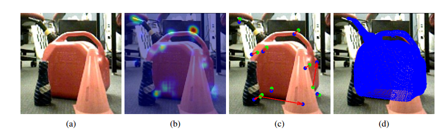

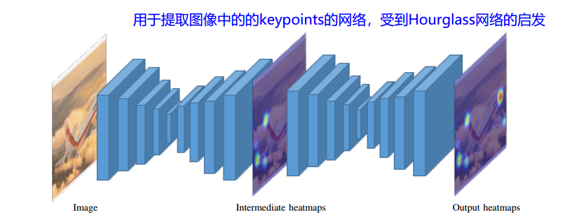

---

### **iPose （ACCV2018）**

* 间接法

* RGB+D

* The first step **localizes** all known objects in the image using an instance segmentation  network, and hence eliminates surrounding clutter and occluders. 

* The second step densely **maps** pixels to 3D object surface positions, so called object coordinates, using an encoder-decoder network, and hence eliminates object appearance. 

* The third, and final, step **predicts** the 6D pose using geometric optimization.  这一步只是单纯的计算，不用进行学习。

* 使用网络预测密集的2D-3D关系

* 结合mask结果，和2D-3D关系，通过论文提出的计算方法求得6d pose

* 由于是密集的**2D-3D**关系，算法会用到hypotheses

  * 使用pre-emptive RANSAC来最大化一个目标函数，从而得到位姿信息

  $$
  S_{RGB}(H)=\sum_{i\in M}\left[ || p_j-AHC^j||_2 < \tau_{in}\right]
  $$

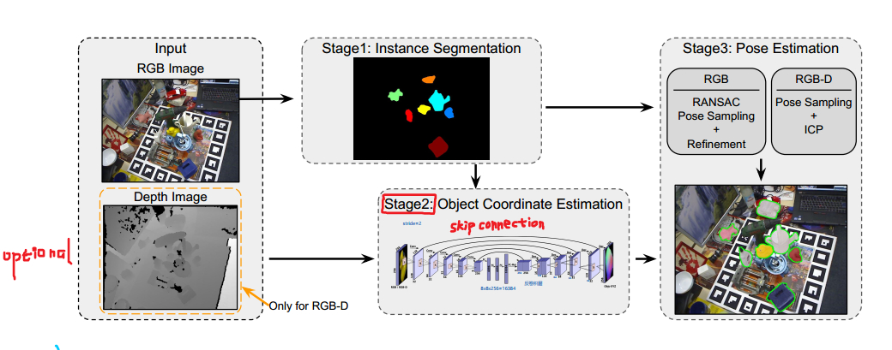

---

### **PVNet（CVPR2019）**

* 间接法
* 仅RGB
* 关键点的估计+位姿的最优解求解，通过最小化一个表示投影误差的马氏距离函数
  * 关键点的估计用投票策略
  * 关键点hypotheses的均值和方差来解Uncertainty-driven PnP
* 关键点的选取使用FPS（*FarthestPointSampling*）
* 采用向量场的表示形式来估计关键点的位置，向量场的概念自参考PoseCNN
* 提出了truncation的场景
* 提出了直接在2D-3D关系上使用PnP可能得到的结果不是准确的

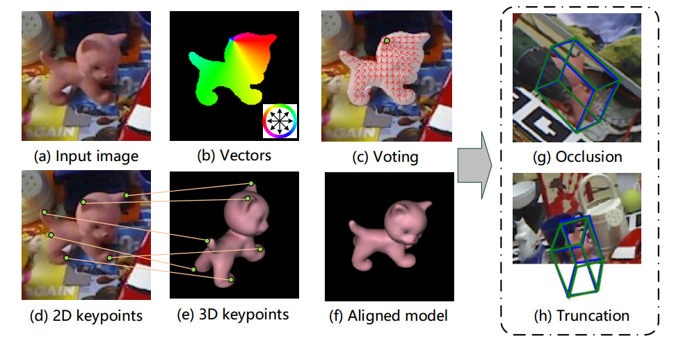

---

### **DOPE**（2018）

* 间接法
* This system uses a simple deep network architecture, **trained entirely on simulated data**, to **infer the 2D image coordinates of projected 3D bounding boxes**, followed by  **perspective-n-point (PnP)** [12]. We call our system DOPE.
* 也是2D-3D关键点 + PnP求解
  * 网络有两个不同的输出：belief maps和vector fields
  * 有9个belief maps，表示3d物体的vertices投影的位置
  * 8个vector fields表示2d关键点位置
  * 根据belief maps和vector fields得出2d关键点的位置
  * 随后用PnP
* 但是使用的全部都是合成数据
* 并且探讨和如何解决合成数据存在reality gap的问题
* UE4上的NDDS插件，
* 该论文较为关键的其实时合成数据的方法，即论文所开发的插件

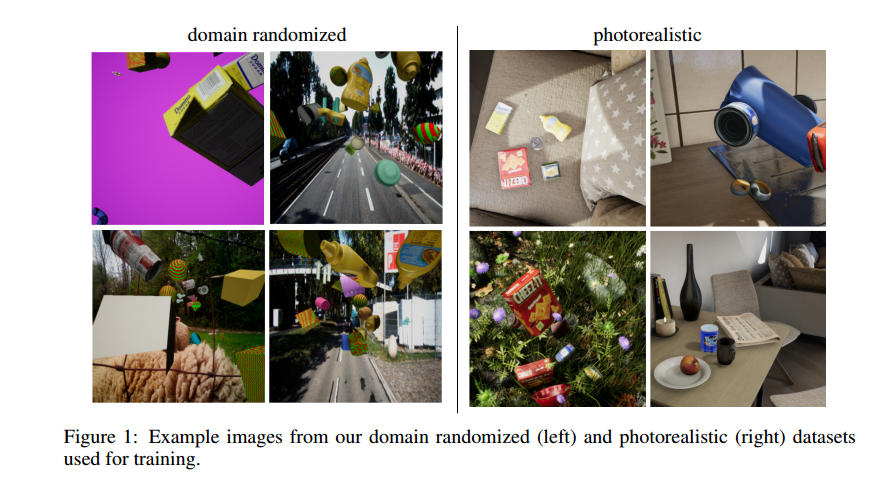

---

### **HybridPose（CVPR2020）**

* 间接法
* 探讨了更多种的间接表示形式，关键点仍然作为最主要的间接表示形式，随后还引入了关键点之间的关系作为中间表示形式来修正关键点预测，还引入了对称物体的对称信息作为中间形式。

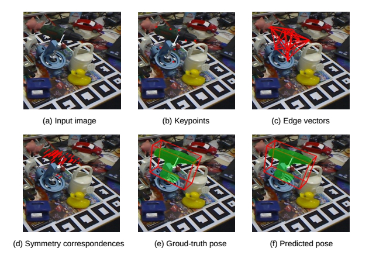

---

### **Segmentation-driven 6D Pose** (CVPR2019)

* Segmentation-driven 6D Object Pose Estimation  

* 生成2D-3D关系 + PnP
* 生成2D-3D关系则使用了**image patches**的思想，有点像BB8或者YOLO6D，即将一张图片划分成很多个小patches，每个patches都估计这个patch中存在哪类物体，和这个物体的关键点在相对于patch的什么位置，总结所有patch的信息则得到a set of 3D-2D correspondences

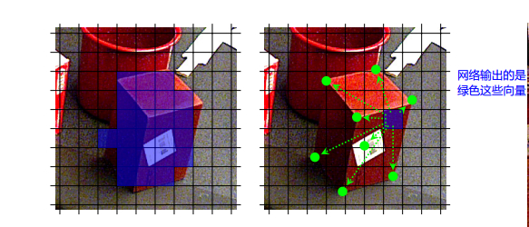

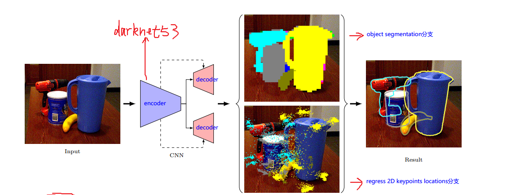

---

### CDPN (ICCV2019)

* RGB方法
* 间接求旋转，直接求平移
* 旋转量和平移量**分开求解**。（PoseCNN中的旋转和平移量也是分开求解的）
* 对于旋转量，使用网络输出置信度图，密集的3D坐标，相当于也是建立的**2D-3D**关系，随后用PnP求解得到位姿，**但是只取位姿的旋转分量部分，平移分量部分则不使用**，而是用另外一种方法求解。
* 提出**DZI**和和**SITE**来求解平移。
* 网络依旧使用到了物体检测的模块

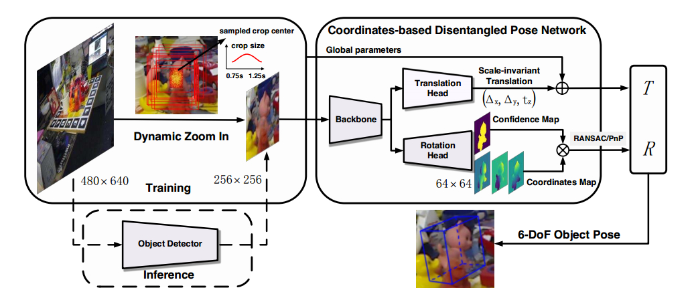

------

## 直接法

### PoseCNN (2018)

* 直接+间接

* RGB-D都需要

* 将6D Pose中的平移量和旋转量分开求解。

* 对于平移量，估计图片中物体的中点的2D位置，随后使用相机模型投影公式估计平移量。具体使用的一种投票的思想，提出向量场。也就是估计平移量时间接法进行估计。

* $$
  \left[\begin{array}{c} c_x \\ c_y \end{array}\right] = \left[\begin{array}{c} f_x\frac{T_x}{T_z} + p_x \\ f_y\frac{T_y}{T_z}+p_y \end{array}\right]
  $$

* 对于旋转量，使用的时直接法进行估计，论文中直接进行回归求解。将检测到的物体截取出来后输入到一个全连接网络中，直接回归给出旋转量的四元数表示

* **制作了YCB-Video数据集**

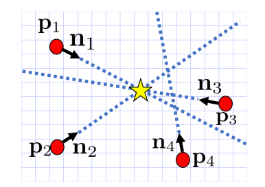

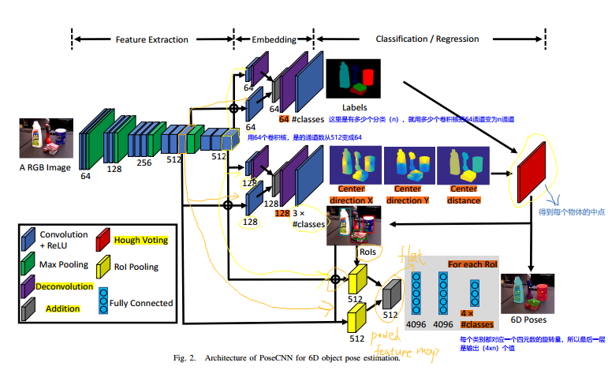

---

### **SSD-6D**

* RGB

* single shot
* 仅用合成数据训练
* discretized the 3-DoF rotation space into classifiable viewpoint bins and solved it by  training a classifier built on a SSD-based detection framework, whereas the 3-DoF  translation was obtained from the 2D bounding boxes.   
* 可以认为是**直接法**中的一种
* 相当于是分类问题？而不是回归数值表示旋转和平移

---

### Deep-6DPose (2018)

* 直接法，直接用网络暴力求解。输入图片，输出位姿信息。
* RGB
* 旋转量和平移量同样时分开计算，但是时由同一个网络输出
* 平移量的计算和PoseCNN相似，只使用网络估计出一个深度值，在用相机模型投影的公式来计算平移量；把2d bbox的中心点当作物体的中心点。
* 旋转量的表示则使用李代数来表示，这个比较新颖，之前的论文好像都没有想到要用李代数来表示；网络的输出相当于时一个**旋转向量**，因为没有约束，所以论文使用这个表示旋转。
* 整体框架是基于**MaskRCNN**

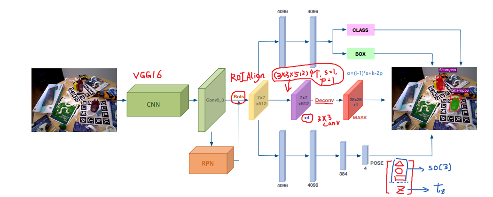

## RGB-D + Fusion类的方法

### 介绍

* 这类方法会更多考虑充分挖掘深度（或点云）信息
* 将RGB的信息和和点云信息进行融合，从而得到表达更加准确的特征，再进一步进行位姿的估计
* 这类方法更加注重信息的融合，因此叫做**XXXFusion**
* 这类方法大都会分开处理图像和点云，最后再进行融合。
* 这类方法结构通常较为庞大，不指一个深度网络，通常包含处理图像和处理点云的两个深度网络。计算量大。

---

### PointFusion (CVPR2018)

* 使用RGB和点云信息

* 这是一个原本进行3D物体检测的深度网络
* 这类方法的实验场景是室外道路
* 这个方法仅预测物体3D边界框

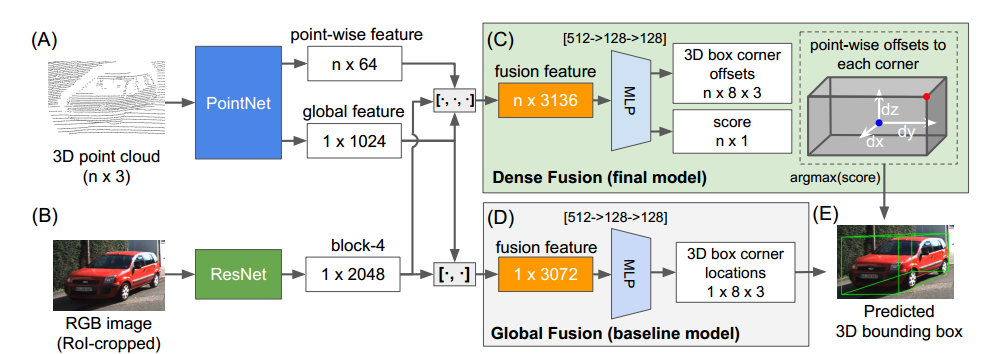

---

### DenseFusion (CVPR2019)

* 使用RGB-D信息
* 分成两部分分别单独处理输入图片信息和深度信息
* 使用一个融合网络提取**pixel-wise dense feature embedding**
* 还提出了一个端到端的**iterative pose refinement procedure**来调整估计的位姿 

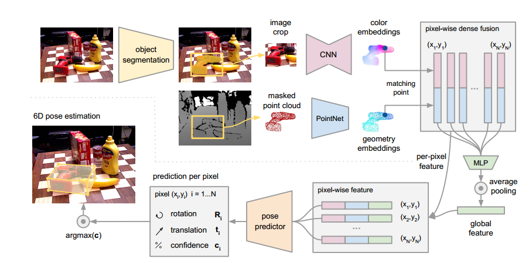

* 涉及的技术
  * 初步：
    * 语义分割和物体检测，将检测到的物体从原图中截取出来；
    * 同时根据分割结果提取处深度信息并送入点云处理网络；
    * 论文提到说用的语义分割直接用PoseCNN现成的分割网络。
  * 初步提取到的物体图像和点云信息还要分别进入CNN和PointNet进行处理；
  * 提出全新的融合网络

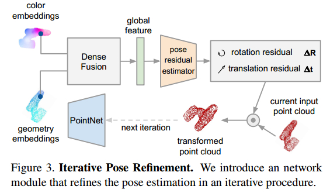

---

### MaskedFusion (ICMLA 2020)

* 使用RGB-D信息
* 相较于DenseFusion仅融合RGB和点云信息，这个方法还**多融合了mask**的信息

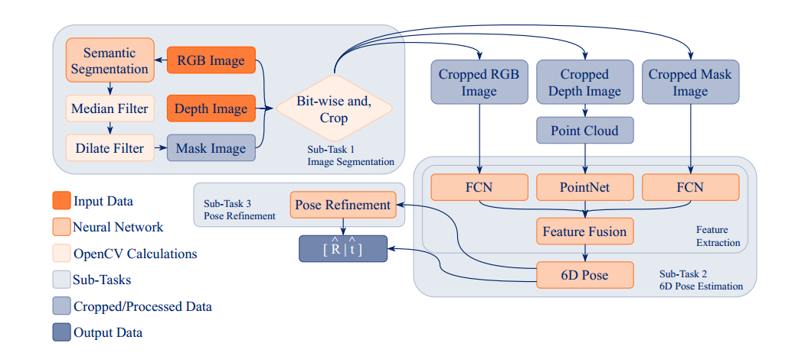

---

### PVN3D (CVPR 2020)

* RGB-D
* 使用RGB和点云特征融合
* **在三维空间的点云进行投票**，二维投票的扩展
* 直接使用到了**三维关键点**
* 得到三维关键点后使用least-squares fitting来对准模型和点云中的关键点来得到物体的位姿

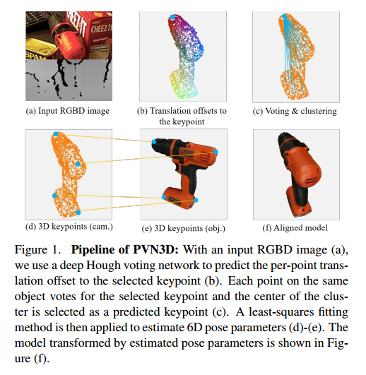

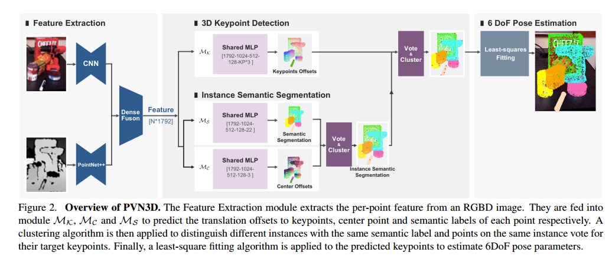

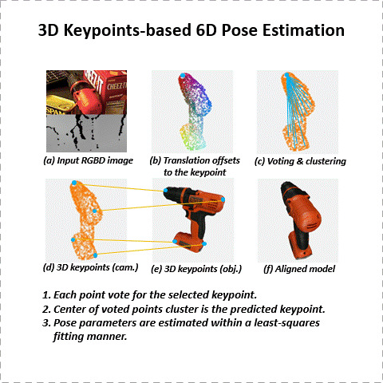

---

## Category-level

### NOCS (CVPR 2019 oral)

* Normalized Object Coordinate Space for Category-Level 6D Object Pose and Size Estimation
* 论文贡献
  * 提出NOCS的概念
  * 公布了两个数据集，一个是合成的，解决了domain gap的问题；另一个是小型的真实数据集
* 类级别的位姿估计
* 使用信息
  * RGB，会输入网络进行卷积
  * 深度信息，不需要输入网络，直接和网络输出的结果进行联合计算得到最终的位姿信息
* 提出了NOCS空间，每一类物体都有一个NOCS空间，同一类物体的不同实例是共享同一个NOCS的
* NOCS是论文中定义的一个三维空间，是一个单位立方体内部的空间
* 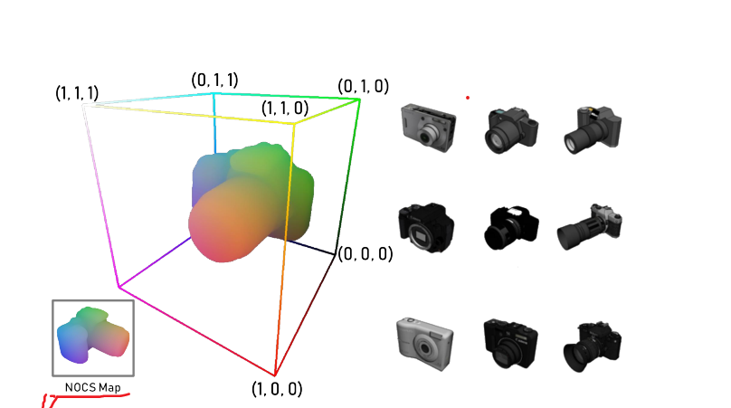
* 而训练CNN网络用的是**NOCS map**
* 整体框架基于**MaskRCNN**，CNN网络仅预测class labels, masks, NOCS maps
  * NOCS maps有三个分量——(x, y, z)，关键是要弄清楚NOCS在数据集中是怎样的形式

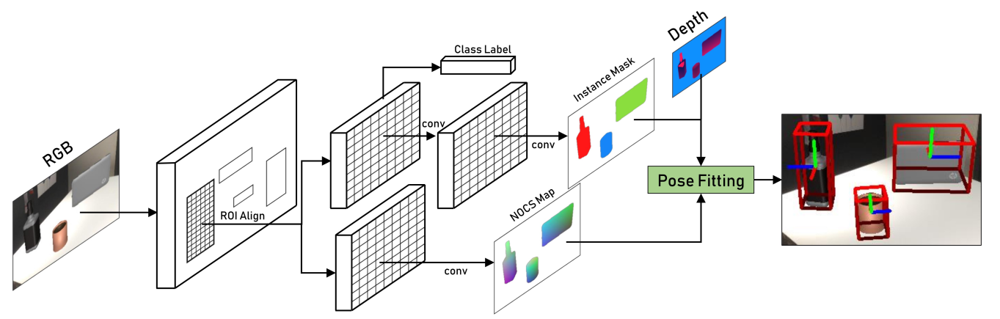

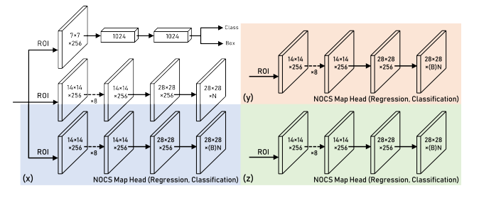

---

## 传统方法

### 模板匹配LINEMOD

* To be continued...

---

### 点对特征Point Pair Feature (Year of 2010)

* Model Globally, Match Locally: Efficient and Robust 3D Object Recognition  

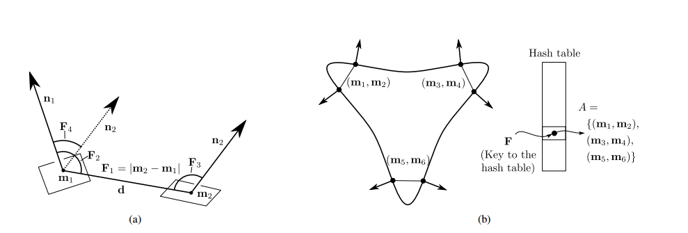

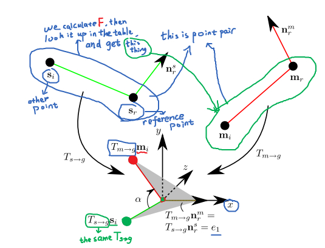

realsense

户外场景

对象

代表性算法

问题导向

不应该再局限于特定的数据集了

透明、反光、低纹理

类级别

